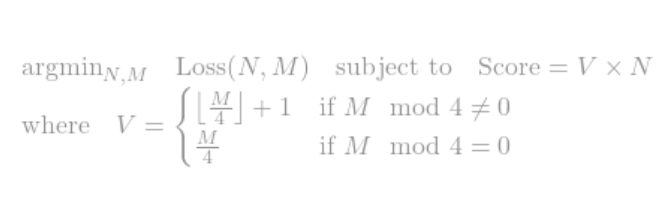

## Modeling y = tanh(2x)
### Satisficing equation

### Results
#### Sample Length of 1e2 (Total Data Train + Test = 1e3)
Time Taken: 1179.01 seconds approx. 0.014 days
Top 10 architectures with the lowest losses:

1. N = 7, M = 40, Loss = 1.007e-04, Score = 70
2. N = 5, M = 45, Loss = 1.042e-04, Score = 60
3. N = 3, M = 47, Loss = 1.702e-04, Score = 36
4. N = 3, M = 49, Loss = 1.735e-04, Score = 39
5. N = 6, M = 45, Loss = 1.896e-04, Score = 72
6. N = 12, M = 47, Loss = 1.936e-04, Score = 144
7. N = 5, M = 44, Loss = 2.085e-04, Score = 55
8. N = 3, M = 28, Loss = 2.236e-04, Score = 21
9. N = 5, M = 41, Loss = 2.244e-04, Score = 55
10. N = 6, M = 26, Loss = 2.455e-04, Score = 42

#### Sample Length of 1e5(Total Data Train + Test = 1e6)
Time Taken: 105705.32 seconds approx. 1.223 days
Top 10 architectures with the lowest losses:

1. N = 6, M = 44, Loss = 5.380e-07, Score = 66
2. N = 16, M = 37, Loss = 6.351e-07, Score = 160
3. N = 12, M = 49, Loss = 1.046e-06, Score = 156
4. N = 8, M = 45, Loss = 1.096e-06, Score = 96
5. N = 8, M = 49, Loss = 1.172e-06, Score = 104
6. N = 10, M = 43, Loss = 1.216e-06, Score = 110
7. N = 19, M = 47, Loss = 1.262e-06, Score = 228
8. N = 8, M = 24, Loss = 1.290e-06, Score = 48
9. N = 9, M = 16, Loss = 1.315e-06, Score = 36
10. N = 7, M = 37, Loss = 1.340e-06, Score = 70

